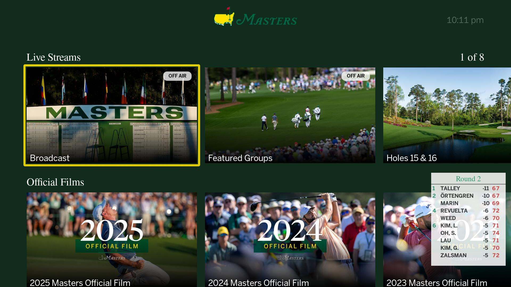
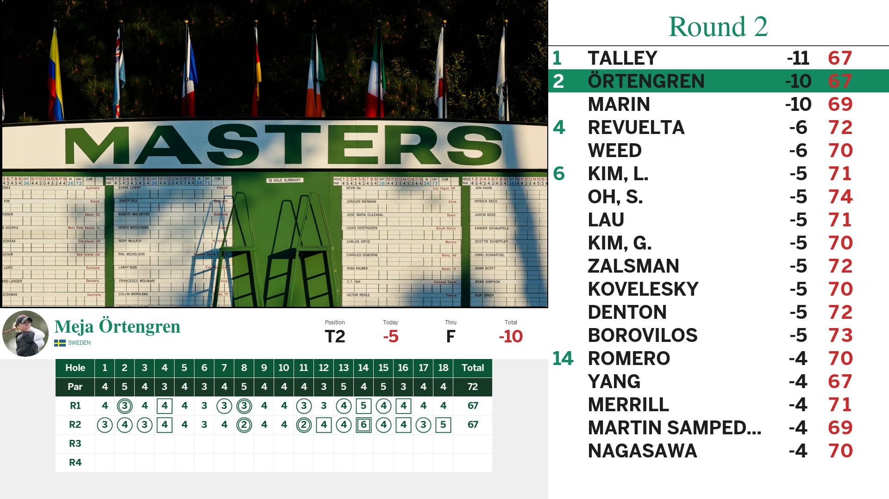

# Archived

I've been IP blocked from the Masters. (Spoiler: A simple message would have gotten me to take it down. Would have been less work too haha)

---

# Sam's Masters App

Roku app for watching the Masters.com streams and videos with leaderboards.

[**Buy Me A Beer or a Tee Time**](https://account.venmo.com/u/Sam-Heavner)

### Live Stream and Masters Vault



### Live Scoreboard During Playback



# Installation

1. download the latest release at [Releases](https://github.com/samheavner/sams-masters-app/releases)
1. side-load the `.zip` file on your Roku device (see [Roku's developer guide](https://developer.roku.com/docs/developer-program/getting-started/developer-setup.md) for instructions)
1. enjoy

Before you ask, no private channels will be provided. You must side-load the app yourself with the above instructions.

# For Developers

## Requirements
- Node.js (for the BrightScript compiler)
- A Roku device on the same network (set host/password in [`.env`](.env))
- VS Code (optional, project includes a debug config)
x
## Build
Build the BrightScript package with the provided NPM script:

```sh
npm run build
```

(package config: [package.json](package.json), BrightScript config: [bsconfig.json](bsconfig.json))

The build output is assembled into the staging directory `.stage` (used by the VS Code debug config: [.vscode/launch.json](.vscode/launch.json)).

## Run / Debug
- Use the "Debug" launch configuration in VS Code (reads `.env` for `roku_host`/`roku_pass`) to deploy and debug on-device.
- The app entrypoint is [src/source/main.bs](src/source/main.bs).

## Project layout (important files)
- App manifest: [src/manifest](src/manifest)
- App entry: [src/source/main.bs](src/source/main.bs)

UI components and code:
- Scene root: [src/components/MastersScene.xml](src/components/MastersScene.xml) and logic [src/components/MastersScene.bs](src/components/MastersScene.bs)
- API client: [src/components/api/MastersApi.bs](src/components/api/MastersApi.bs) (`MastersApi.getScores`, `MastersApi.getLiveStreams`, `MastersApi.getVideoVault`)
  - Service task: [src/components/api/MastersApiService.xml](src/components/api/MastersApiService.xml) and [src/components/api/MastersApiService.bs](src/components/api/MastersApiService.bs) (`MastersApiService.getScores`, `MastersApiService.getLiveStreams`, `MastersApiService.getVideoVault`)
- Video + leaderboard view: [src/components/views/VideoLeaderboard.xml](src/components/views/VideoLeaderboard.xml) and [src/components/views/VideoLeaderboard.bs](src/components/views/VideoLeaderboard.bs)
- Small leaderboard: [src/components/views/SmallLeaderboard.xml](src/components/views/SmallLeaderboard.xml) and [src/components/views/SmallLeaderboard.bs](src/components/views/SmallLeaderboard.bs)
- Row components:
  - [src/components/views/VideoLeaderboardRow.xml](src/components/views/VideoLeaderboardRow.xml) / [src/components/views/VideoLeaderboardRow.bs](src/components/views/VideoLeaderboardRow.bs)
  - [src/components/views/SmallLeaderboardRow.xml](src/components/views/SmallLeaderboardRow.xml) / [src/components/views/SmallLeaderboardRow.bs](src/components/views/SmallLeaderboardRow.bs)
- Player card: [src/components/views/PlayerCard.xml](src/components/views/PlayerCard.xml) and logic [src/components/views/PlayerCard.bs](src/components/views/PlayerCard.bs) (`PlayerCard.onContent`)
- Item component for feeds: [src/components/items/SimpleItem.xml](src/components/items/SimpleItem.xml) / [src/components/items/SimpleItem.bs](src/components/items/SimpleItem.bs)
- UI primitives:
  - [src/components/views/SimpleLabel.xml](src/components/views/SimpleLabel.xml) / [src/components/views/SimpleLabel.bs](src/components/views/SimpleLabel.bs)
  - [src/components/views/PillText.xml](src/components/views/PillText.xml) / [src/components/views/PillText.bs](src/components/views/PillText.bs)
  - [src/components/views/SimpleButton.xml](src/components/views/SimpleButton.xml) / [src/components/views/SimpleButton.bs](src/components/views/SimpleButton.bs)

Utilities:
- Color blending: [src/components/utils/ColorBlender.bs](src/components/utils/ColorBlender.bs) (`ColorBlender.getBlendedColor`)
- Country code mapping: [src/components/utils/CountryCodes.bs](src/components/utils/CountryCodes.bs) (`CountryCodes.getImageCode`)

Assets:
- Fonts: [src/components/fonts/](src/components/fonts) and referenced from [SimpleLabel](src/components/views/SimpleLabel.xml)
- Images: [src/components/images/](src/components/images) (icons, masks, posters, etc.)

## How the API layers work
- `MastersApi` performs HTTP requests and returns parsed JSON to callers ([src/components/api/MastersApi.bs](src/components/api/MastersApi.bs)).
- `MastersApiService` is a Task that serializes API requests and returns results via a `PromiseNode` ([src/components/api/MastersApiService.bs](src/components/api/MastersApiService.bs) / [src/components/api/PromiseNode.xml](src/components/api/PromiseNode.xml)).

## Notes for contributors
- The BrightScript source is under `src/`. The staging output is written to `.stage` by the build.
- To add UI components, put `.xml` and `.bs` files under `src/components/` and reference them from scenes.
- Keep network calls in the API classes and use the service task to avoid blocking the main thread.

## Troubleshooting
- If deploying from VS Code fails, confirm `.env` has correct `roku_host` and `roku_pass` values.
- Increase the request timeout in [src/components/api/MastersApi.bs](src/components/api/MastersApi.bs) if network requests time out.

